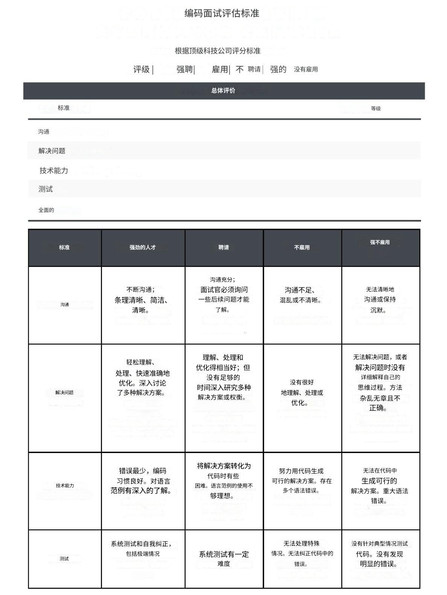

# 编码面试评分标准

有没有想过谷歌、亚马逊、苹果和 Netflix 等顶尖科技公司如何评估编码面试？

在顶尖科技公司中，编码面试评估标准实际上并没有太大差异。虽然评分标准中使用的具体术语可能不同，但评估的维度大致相同。

在本指南中，我将详细介绍大型科技公司的一般编码面试评估流程。我还提供了一个[示例评分标准](bian-ma-mian-shi-ping-fen-biao-zhun.md)，您可以在自己或与同伴练习时使用。

如果您还没有这样做，请参考我的[编码面试最佳实践备忘单](shi-qian-shi-zhong-he-shi-hou-de-zui-jia-shi-jian.md)，它基本上总结了候选人应该做些什么来满足编码面试中的评估标准。

### 候选人评分方法 

一般来说，在 FAANG / MANGA 公司中，编码面试评估标准大致可以分为 4 个维度：

1. 沟通 - 候选人是否在编码时做出澄清、传达他们的方法并进行解释？
2. 解决问题——候选人是否表明他们了解问题并能够提出合理的方法、进行权衡分析并优化他们的方法？
3. 技术能力 - 执行速度和准确性如何？是否存在语法错误？
4. 测试 - 代码是否针对常见情况和极端情况进行了测试？它们是否自行纠正了错误？

编码面试中候选人评分的一般方法有两种：

1. 为每个维度提供一个分数（例如 1-4），并将它们相加得到一个总分
2. 根据各维度的总体表现提供总体评分（例如 1-4）

无论使用何种方法，评分等级一般为：

* 强力聘用
* 聘请
* 沒有僱傭
* 强不聘

当面试官认为应聘者需要进一步评估时，一些公司可能会将犹豫程度设在一个中间水平。

### 你的分数如何影响结果？ 

无论评分方法如何，最终得分都是基于评估标准的整体表现（而不是纯粹通过某个数学截止标准）。

每次电话面试通常只有 1 名面试官，因此如果他们没有给您“通过”的评价（相当于“倾向于聘用”或更高），您将无法进入整个面试环节。如果该轮面试没有获得明确的信号，您可能会被要求进行后续电话面试。

大多数顶级科技公司都允许应聘者参加完整面试环节的每一轮面试，然后根据最终结果做出决定。如果应聘者在不同面试环节中得到的结果好坏参半（有的“通过”，有的“失败”），面试官会根据你表现出的信号召集大家讨论。这就是为什么你在整个面试环节中的表现很重要。

在某些情况下，例如后续电话面试，如果符合以下情况，候选人可能会被邀请参加额外的评估：

* 评估中遗漏了一些方面，例如，两轮编码面试官给出了非常相似的问题
* 候选人在特定区域显示的信号混杂，需要进行额外轮次才能获得更可靠的信号

一般来说，所有面试官都可以看到你每轮的得分和反馈。有时，面试官甚至可以看到你过去在同一家公司面试的反馈，以避免再次问同样的问题。公司希望看到你与过去相比有所成长。因此，如果你过去被一家公司拒绝过，请反思可能的原因，并在再次与该公司面试时解决这些问题。

### 每个评估标准 

#### 1.沟通 

基本通信信号：

* 提出适当的澄清问题
* 传达方法、原理和权衡
* 即使在编码时也要不断沟通
* 组织良好、简洁、沟通清晰

<table><thead><tr><th width="146">评分</th><th>综合评价</th></tr></thead><tbody><tr><td>强烈推荐录用</td><td>在整个面试过程中，候选人的沟通非常全面、有条理、简明且思路清晰——包括他们如何理解问题、解决思路以及权衡取舍等方面。面试官完全没有困难理解候选人的思维过程。</td></tr><tr><td>倾向录用</td><td>在整个面试过程中，候选人的沟通足够清晰且有条理。但面试官需要通过追加提问，才能理解候选人在某些方面的思路和方法。</td></tr><tr><td>倾向不录用</td><td>在整个面试过程中，候选人的沟通存在以下一种或多种问题：(1) 不足（如直接开始写代码而没有解释思路），(2) 缺乏条理或不清晰。面试官在理解候选人的思维过程时存在困难。</td></tr><tr><td>强烈不录用</td><td>候选人无法清晰表达，甚至在面试官主动提问时也保持沉默。面试官在理解候选人的思维过程时遇到了极大的困难。</td></tr></tbody></table>

#### 2.解决 

基本解决问题的信号：

* 通过提出好的澄清问题来快速理解问题
* 系统而有逻辑地处理问题
* 能够提出优化的解决方案
* 准确确定时间和空间复杂度
* 不需要面试官给出任何重要提示

高级问题解决信号：

* 想出了多个解决方案
* 清楚正确地解释每个解决方案的权衡，得出哪个解决方案最适合当前场景的结论
* 有时间讨论后续问题/扩展

<table><thead><tr><th width="145">评分</th><th>综合评价</th></tr></thead><tbody><tr><td>强烈推荐录用</td><td>顺利完成了所有基本问题解决信号，并且留有足够时间完成了大部分高级问题解决信号。</td></tr><tr><td>倾向录用</td><td>完成了所有基本问题解决信号，但没有足够时间完成高级问题解决信号。</td></tr><tr><td>倾向不录用</td><td>仅展示了部分基本问题解决信号，未能完成其余部分。</td></tr><tr><td>强烈不录用</td><td>无法解决问题，或在解决问题时未能解释自己的思路。方法缺乏条理且不正确。</td></tr></tbody></table>

#### 3. 技术能力 

基本技术能力信号：

* 将讨论的解决方案转化为工作代码，且错误极少甚至没有错误
* 干净、直接的实现，没有语法错误和不必要的代码，良好的编码习惯，例如 DRY（不要重复自己），使用适当的抽象
* 整洁的编码风格（正确的缩进、间距、变量命名等）

先进的技术能力信号：

* 比较几种编码方法
* 展现出对语言结构和范式的深刻了解

<table><thead><tr><th width="146">评分</th><th>综合评价</th></tr></thead><tbody><tr><td>强烈推荐录用</td><td>轻松展示了基本和高级的技术能力信号。</td></tr><tr><td>倾向录用</td><td>仅展示了基本的技术能力信号，在将思路转化为代码时出现一些困难。编程语言的使用不够优化。</td></tr><tr><td>倾向不录用</td><td>在编写代码时难以得出可行的解决方案。出现多次语法错误，且编程语言使用不当。</td></tr><tr><td>强烈不录用</td><td>无法编写出可行的解决方案。存在重大语法错误，且编程语言使用极不合理。</td></tr></tbody></table>

#### 4.测试 

测试信号：

* 提出了更多典型案例并针对其测试了他们的代码
* 发现并处理特殊情况
* 识别并自行纠正代码中的错误
* 能够以系统的方式验证代码的正确性（例如，像调试器一样运行并逐步执行每一行，在每一步更新程序的状态）

<table><thead><tr><th width="144">评分</th><th>综合评价</th></tr></thead><tbody><tr><td>强烈推荐录用</td><td>轻松展示了测试能力信号。</td></tr><tr><td>倾向录用</td><td>在展示测试能力信号时存在一些困难，例如未能识别所有相关的边界情况。</td></tr><tr><td>倾向不录用</td><td>进行了测试，但未处理边界情况。无法识别或修正代码中的错误。</td></tr><tr><td>强烈不录用</td><td>未对代码进行基本情况的测试。未发现明显的代码错误，却宣布已完成。</td></tr></tbody></table>

<figure><figcaption>
编码面试评估标准样本，供练习使用
</figcaption></figure>
