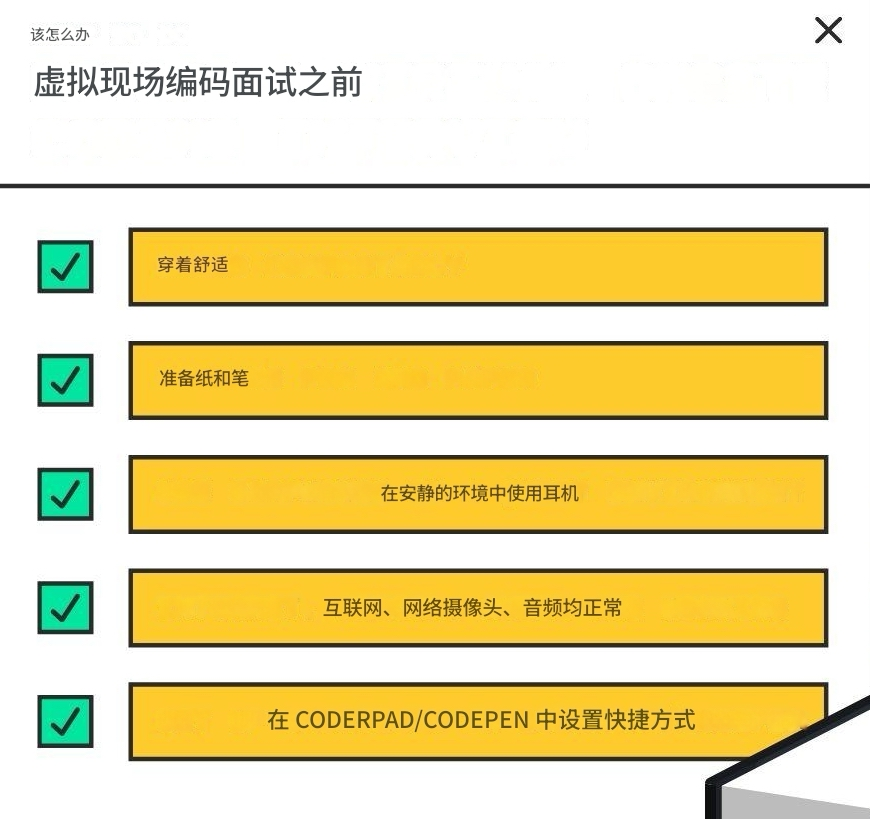
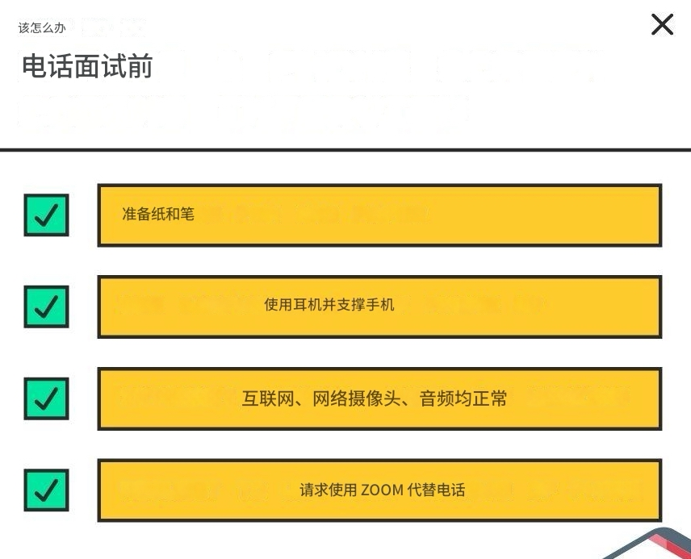
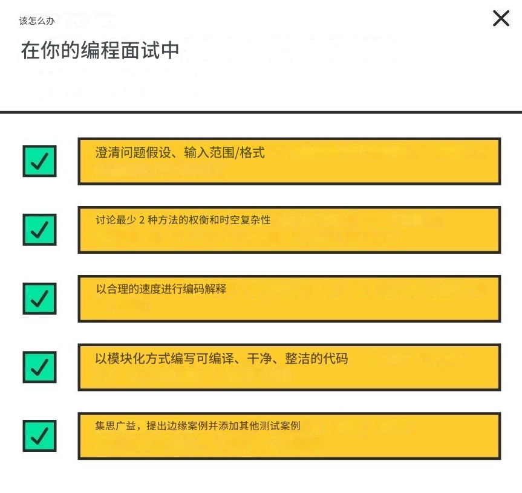
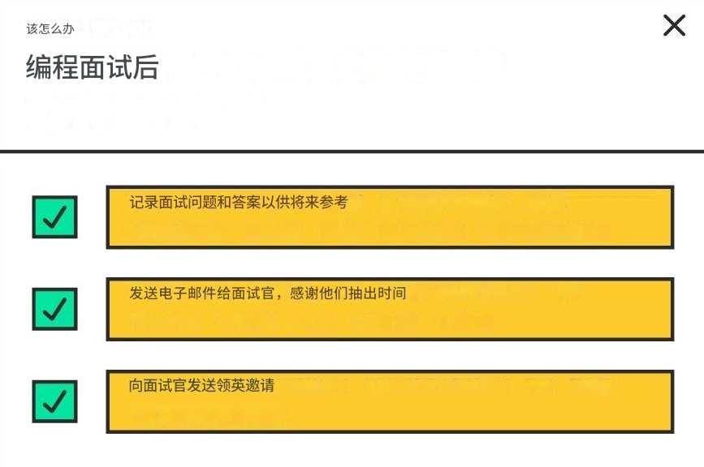

# 事前、事中和事后的最佳实践

随着编程面试的日趋成熟，现在人们对应聘者在编程面试中的行为举止有了更严格的要求。其中一些做法还有助于你向面试官展示“录用”信号，展示你良好的沟通能力和处理障碍的能力。

我们从顶尖候选人那里获得最佳实践，并根据[您在编码面试中的评估方式](bian-ma-mian-shi-ping-fen-biao-zhun.md)，我们在详尽的清单中总结了一些关于如何在编码面试中表现的最重要的技巧 - 包括应该避免的最大错误。

在开始练习编程面试问题之前，你应该阅读并熟悉本指南。在练习 LeetCode 的同时，本指南将帮助你尽早养成这些重要的编程面试行为。

### 编程面试_前_ 该做什么 

*   ✅ 穿着舒适。

    > 通常不需要穿正式的衣服，休闲装就可以了。大多数地方都接受T恤和牛仔裤。
* ✅ 确保您已阅读并准备好[自我介绍](../xing-wei-mian-shi-zhun-bei/zhun-bei-zi-wo-jie-shao.md)和[最后要问的问题](../xing-wei-mian-shi-zhun-bei/zhun-bei-zui-hou-yao-wen-de-wen-ti.md)。

#### 对于虚拟现场编码面试 

<figure><figcaption>
虚拟现场编码面试前应做的事情总结
</figcaption></figure>

*   ✅ 准备好纸和笔。

    > 如果你需要记下并形象化一些东西。绘图对于树木/图表问题特别有用
*   ✅ 使用耳机或头戴式耳机并确保您处于安静的环境中。

    > 避免使用扬声器，因为如果回声很大，沟通会变得更加困难，参与者重复自己的话只会导致宝贵时间的浪费。
* ✅ 检查您的互联网连接是否正常。
* ✅ 检查您的网络摄像头和音频是否正常工作。
*   ✅ 熟悉并设置编码环境（CoderPad / CodePen）的快捷方式。

    > 设置编辑器快捷键，打开自动完成、制表符间距等。如果你知道这些快捷键并能很好地使用它们，面试官会对你印象深刻
*   ✅ 如果可能的话，关闭网络摄像头。

    > 大多数远程面试不需要视频聊天，而保持视频聊天只会分散注意力并占用网络带宽。

#### 对于电话屏幕编码面试 

<figure><figcaption>
电话屏幕编码面试前应做的事情总结
</figcaption></figure>

*   ✅ 戴上耳机并将手机放在桌子上。

    > 避免一只手拿着手机，另一只手打字
*   ✅ 请求使用 Zoom/Google Meet/Hangouts 或 Skype 代替电话的选项。

    > 发送链接或文本更加容易。

#### 对于现场白板编码面试 

*   ✅ 了解白板空间管理。

    > 在代码行之间留出空格，以防需要在现有代码之间插入行。

### 编码面试_期间_该做什么 

<figure><figcaption>
编码面试中应做的事情总结
</figcaption></figure>

#### 1.面试 

*   ✅ 在一两分钟内用几句话介绍自己。

    > 按照我们的指南，了解如何为软件工程师进行良好的自我介绍
*   ✅ 听起来很热情！

    > 带着微笑说话，你自然会听起来更有吸引力。
* ❌ 不要花太长时间进行自我介绍，因为这样你将没有太多时间进行编码。

#### 2. 收到问题后，做出澄清 

**不要马上开始编程。**编程问题往往含糊不清，故意不明确，以便让面试官判断应聘者对细节的关注和细心程度。至少问 2-3 个澄清问题。

*   ✅ 向面试官解释并重复该问题。

    > 确保您准确理解他们的要求。
* ✅ 澄清假设（请参阅[算法备忘单](../algorithms-study-cheatsheet/introduction.md)以了解常见假设）
  * > 树形图很可能是允许循环的图，而简单的递归解决方案不起作用。澄清给定的图是树还是图。
  * > 您可以以任何方式修改原始数组/图形/数据结构吗？
  * > 输入是如何存储的？
  * > 如果给你一本词典，它是字符串列表还是 Trie？
  * > 输入数组是否已排序？（例如，在二进制/线性搜索之间做出决定）
*   ✅ 明确输入值范围。

    > 输入：有多大，范围是多少？
*   ✅ 明确输入值的格式

    > 值：负数？浮点数？空值？Null 值？重复值？极大值？
*   ✅ 通过一个简化的例子来确保你理解了问题。

    > 例如，你被要求编写一个回文检查器，在编码之前，想出一些简单的测试用例，如“KAYAK”=> true，“MOUSE”=> false，然后向面试官核实这些示例用例是否符合他们的期望
* ❌ 不要马上开始编码，或者在面试官允许之前就开始编码。

#### 3. 制定并优化与面试官 

接下来你能做的最糟糕的事情就是直接跳到编码 - 面试官希望有一些时间进行双向讨论，以了解解决问题的正确方法，包括时间和空间复杂性的分析。

根据问题的复杂程度，讨论时间可以从几分钟到 5-10 分钟不等。这也让面试官有机会为您提供提示，指导您找到可接受的解决方案。

* ✅ 如果你在方法或优化上遇到困难，可以用[这种结构化的方式](jie-da-wen-ti-de-ji-qiao.md)来唤起你的记忆/找到一个好的方法
*   ✅ 解释一些你可以采用的高层方法（不要过多地涉及实施细节）。与面试官讨论每种方法的利弊，就好像面试官是你的同事，你们都在合作解决一个问题。

    > 对于算法问题，空间/时间是一种常见的权衡。我们以著名的[二和](https://leetcode.com/problems/two-sum/)问题为例。有两种常见的解决方案
    >
    > 1. 使用嵌套的 for 循环。就时间复杂度而言，其为 O(n 2 )，就空间复杂度而言，其为 O(1)。
    > 2. 在数组的一次传递中，您会将一个值散列到其索引中，并将其放入哈希表中。对于后续值，请查找哈希表以查看是否可以找到可以加起来等于目标的现有值。此方法在时间和空间方面都是 O(N)。讨论这两种解决方案，提及权衡并得出哪种解决方案更好（通常是时间复杂度较低的解决方案）
*   ✅ 陈述并解释你所提出的方法的时间和空间复杂度。

    > 提到时间复杂度为大 O 并解释原因（例如，时间复杂度为 O(n 2 )，因为存在嵌套的 for 循环；空间复杂度为 O(n)，因为创建了一个额外的数组）。使用[算法优化技术](jie-da-wen-ti-de-ji-qiao.md)掌握所有时间和空间复杂度。
* [✅ 确定最理想的方法并进行优化。识别重复/重叠的计算并通过缓存减少它们。请参阅优化解决方案](jie-da-wen-ti-de-ji-qiao.md)的页面。
* ❌ 不要马上开始编码，或者在面试官允许之前就开始编码。
* ❌ 不要忽略任何给出的信息。
* ❌不要表现出对你的方法或分析不确定。

#### 4. 边讨论 

* ✅ 只有在你解释了你的方法并且得到面试官的同意后才开始编码。
*   ✅ 解释你在编码/写作时想要实现的目标。在相关的地方比较不同的编码方法。

    > 这样做就证明了你对所选编程语言的掌握。
*   ✅ 以合理的速度编码/书写，以便您可以交谈 - 但不要太慢。

    > 你需要打字速度足够慢，以便解释代码，但也不能太慢，因为你可能会没有时间回答所有的问题
* ✅ 尽可能编写实际可编译、可运行的代码，而不是伪代码。
*   ✅ 编写干净、直接、整洁的代码，尽可能减少语法错误/缺陷。

    > 始终追求简洁明了的实现，而不是复杂混乱的实现。确保按照语言范例和结构采用整洁的编码风格和良好的编码实践。应尽可能避免语法错误和错误。
*   ✅ 使用能够解释你的代码的变量名。

    > 好的变量名很重要，因为你需要向面试官解释你的代码。最好使用能够自我解释的长变量名。假设你需要在一个数字数组中找出 3 的倍数。将结果命名为数组，`multiplesOfThree`而不是数组/数字。
*   ✅ 请求使用简单功能的权限，而无需实现它们。

    > 例如`reduce`，，，`filter`都`min`应该`max`可以使用
*   ✅ 以模块化的方式编写，从高级函数开始，将其分解为更小的辅助函数。

    > 假设你被要求制造一辆汽车。你可以先写几个高级函数：`gatherMaterials()`，`assemble()`。然后分解`assemble()`成更小的函数，，，`makeEngine()`。`polishWheels()`你`constructCarFrame()`甚至可以问面试官是否可以不编写一些琐碎的辅助函数。
*   ✅ 如果你在代码中偷工减料，请大声向面试官说出来，并说明你在非面试环境中会怎么做（没有时间限制）。

    > 例如，“在非面试设置下，我会编写一个正则表达式来解析这个字符串，而不是使用`split()`可能无法涵盖某些边缘情况的表达式。”
* ✅ \[现场 / 白板]练习白板空间管理
* ❌ 面试官说话时不要打断他们。通常，如果他们说话，他们就是想给你提示或引导你朝正确的方向发展。
* ❌不要花太多时间写评论。
* ❌不要重复自己
* ❌不要使用错误的变量名。
  * 不要使用非常冗长或单字符的变量名，（除非它们很常见，如`i`, `n`）变量名
* ❌ 请勿在未检查的情况下复制和粘贴代码（例如，粘贴后可能需要重命名某些变量）。

#### 5. 编码完成后，检查代码并添加测试用例 

编码完成后，不要宣布完成。面试官希望你开始查找错误并添加测试用例来改进代码。

*   ✅ 扫描您的代码以查找错误 - 例如逐一错误。

    > 用全新的眼光阅读你的代码——就好像这是你第一次看到别人写的代码一样——并谈谈你发现错误的过程
*   ✅ 与面试官一起集思广益，讨论极端情况，并添加其他测试用例。（有关常见极端情况，请参阅[算法备忘单）](../algorithms-study-cheatsheet/introduction.md)

    > 给定的测试用例通常设计得比较简单。集思广益，考虑可能出现的极端情况，例如大尺寸输入、空集、单项集、负数。
* ✅ 使用这些测试用例逐步检查你的代码。
* ✅ 留意可以重构的地方。
*   ✅ 重申你的代码的时间和空间复杂度。

    > 这可以让你提醒自己发现代码中可能偏离原始时间和空间复杂度的问题。
* ✅ 解释权衡以及如果有更多时间，代码/方法可以如何改进。
* ❌ 不要立即宣布您已完成编码。先完成上述操作！
* ❌ 不要与面试官争论。他们可能会错，但这种情况不太可能发生，因为他们对这个问题很熟悉。

#### 6. 面试结束时，留下良好印象 

*   ✅ 提出适合公司需求的好的最终问题。

    > 阅读提示和[要询问的最终问题示例](../xing-wei-mian-shi-zhun-bei/zhun-bei-zui-hou-yao-wen-de-wen-ti.md)。
* ✅ 感谢面试官
* ❌ 不要在没有问任何问题的情况下结束面试。

### 编码面试_后_该做什么  

<figure><figcaption>
编码面试后应做的事情总结
</figcaption></figure>

* ✅ 记录下面试问题和答案，因为这些可供将来参考。
*   ✅ 向面试官发送后续电子邮件或 Linkedin 邀请，感谢他们抽出时间并提供面试机会。

    > 作为一名采访者，这些都给我留下了深刻的印象。
