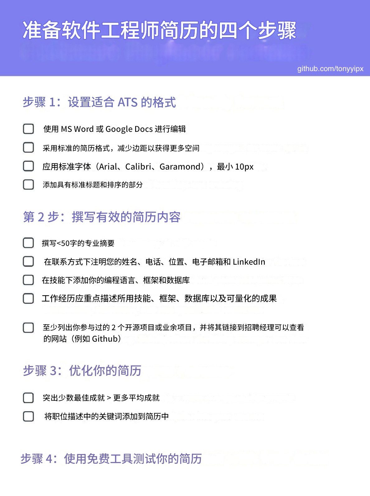

# 撰写软件工程师简历

不确定为什么你仍然没有被一些或所有顶级科技公司列入候选名单？你的软件工程师简历可能是问题所在。

作为一名 FAANG 面试官，我读过大量软件工程简历，即使是我认识的一些最有资格的候选人也因为简历太差而未能入围。大多数人犯的错误是立即假设他们不够资格——但这可能远非事实。

值得庆幸的是，你可以按照特定的步骤和要求来写一份好的软件工程师简历。从简历结构、内容到可以用来测试简历的免费工具，我整理了一份非常简明的最佳实践摘要，以准备 FAANG 软件工程职位的简历：

1. 设置适合 ATS 的简历模板
2. 用结构良好的内容按照有意义的顺序填充模板
3. 通过优先级和关键词优化你的简历
4. 使用免费工具测试简历

### ★如何建立适合 ATS 的软件工程师简历

大多数求职者可能没有意识到，大多数顶尖科技公司都在使用某种形式的 Applicant Tracking Systems 求职者跟踪系统 (ATS) 来解析和筛选数千份简历，甚至在它们到达人眼之前。在许多公司，ATS 甚至可能使用某些规则自动拒绝求职者。

虽然不同的公司可能使用不同类型的 ATS，但可以确保您的软件工程师简历在大多数 ATS 中都能顺利阅读。本部分可确保您的简历至少在 ATS 中完全可读，而接下来的几个部分可提高您通过 ATS 筛选的机会。

#### ◇仅使用 Microsoft Word 或 Google Docs 创建和编辑简历 

**Do's**

* 以 PDF 文件形式提交简历以保留格式，但始终使用 Microsoft Word 或 Google Docs 创建简历。确保简历中的文本易于突出显示非常重要，这是易于解析的先决条件。
* ATS 工具始终致力于提高标准简历格式的可读性 - 因此，简历格式越常见越好。
* 为了最大限度地利用简历上的空间，请不要使用页眉或页脚，而应减少页面的边距 - 每边的窄边距为 0.5。

**Don'ts**

* 不要使用 Photoshop、其他图形设计工具或在线简历生成器来制作简历
* 不要使用 Word/Google Docs 文件中的页眉或页脚部分 - 而是减少边距并只在正文中写入信息。

#### ◇仅使用可读大小的标准字体

新字体可能会将字母转换为 ATS 无法读取的特殊字符。您应该使用的字体 - **Arial、Calibri、Garamond**。

确保您的字体大小在以后的招聘过程中仍然可供人类阅读 - 为便于阅读，请使用最小**10px**的大小。

#### ◇添加具有标准标题和排序的部分

ATS 读者需要识别和解析简历中的标准信息类型。使用标准标题和排序可以帮助他们更好地做到这一点。

这个顺序对我来说很有效，也是招聘人员推荐的：

| 部分                                        | 标题名称                                         |
| ----------------------------------------- | -------------------------------------------- |
| 专业概述                                      | （使用简历标题作为部分标题，例如：“谷歌的高级软件工程师，拥有5年以上的团队领导经验”） |
| 联系信息                                      | “联系信息”                                       |
| 技能 - 编程语言、框架等                             | “技能”                                         |
| 经历                                        | “工作经历”                                       |
| 教育背景（注意：如果你仍在学校或有不到3年的工作经验，你可以把教育背景放在最前面） | “教育背景”                                       |
| 项目                                        | “项目”                                         |
| 其他可选部分 - 例如认证、奖项等                         | “奖项与荣誉” / “认证” / “奖项、荣誉与认证”                  |


警告

切勿在标题中添加符号，以避免 ATS 可读性问题。


### ★如何撰写优秀的软件工程师简历内容

由于软件工程在所需技能和经验方面与其他职业有着本质上的不同，因此对软件工程师简历的内容要求也各不相同。以下各段将涵盖简历各部分通常对软件工程师的要求内容：

#### ◇如何为软件工程师撰写专业摘要

一份好的职业总结可以改变一切。它不仅可以总结你的整个职业经历，而且可以给招聘经理留下良好的印象。

根据我作为软件工程面试官的个人经验，我强烈推荐专业的总结，因为面试官通常没有时间阅读细节 - 因此直接说明为什么候选人适合这份工作的总结可以大大提高他们引起注意的机会。

以下是我撰写出色的软件工程简历摘要的最佳技巧。

**1.开始之前：列出你的最佳卖点**

从你的整个职业经历中，列出符合你申请职位描述的最重要的几点。这可以包括工作经历或技能。

**2.将卖点总结到简历摘要中**

尽可能概括卖点，将其概括为少于 50 个字的简短摘要：

确保你做到以下几点：

* ✅ 回答为什么你适合这份工作
* ✅ 使用主动语态
* ✅ 使用动词
* ✅ 以描述你的工作角色的名词开头，例如“软件工程师”、“前端工程师”

**3.为你的简历摘要写一个标题**

不要将“专业总结”作为章节标题，而是将您的经历进一步精简为少于 10 个字的标题。将其视为 LinkedIn 个人资料标题的稍微更精致的版本。以下是一些示例：

* **Software Engineer (Full Stack)** 软件工程师（全栈）\
  （en）Software Engineer with X years of full stack web development experience specializing in Ruby on Rails and PostgreSQL. Domain expert in e-commerce and payments field as a result of working at multiple e-commerce companies.\
  （cn）软件工程师，拥有 X 年全栈 Web 开发经验，擅长 Ruby on Rails 和 PostgreSQL。曾在多家电子商务公司工作，是电子商务和支付领域的专家。
* **Senior Front End Engineer** 高级前端工程师\
  （en）Front End Engineer with X years of experience and strong fundamentals in Front End technologies. Likes building scalable web infrastructure and making websites fast. Passionate about programming languages, compilers, and developer tooling.\
  （cn）拥有 X 年经验且具备扎实前端技术基础的前端工程师。喜欢构建可扩展的 Web 基础架构并加快网站速度。对编程语言、编译器和开发人员工具充满热情。
* **Software Engineering Lead** 软件工程主管\
  （en）Software Engineer with X years of experience in back end, scaling complex distributed systems, and various cloud platforms. Led over 5 engineering teams with an average size of 6 members across two companies and mentored over 20 junior members.\
  （cn）软件工程师，在后端、扩展复杂分布式系统和各种云平台方面拥有 X 年经验。领导过两家公司超过 5 个工程团队，平均规模为 6 名成员，并指导过超过 20 名初级成员。
* **Senior at University X** 某大学四年级\
  （en）Senior Year student at University X with a focus on Artificial Intelligence and Machine Learning (ML). Interned at X companies and worked on full stack development and ML engineering roles.\
  （cn）X 大学四年级学生，主修人工智能和机器学习 (ML)。曾在 X 公司实习，从事全栈开发和 ML 工程职位。


信息

[请参阅FAANG Tech Leads 的简历手册，](https://www.faangtechleads.com/resume/professional-summary)了解如何让您的专业摘要脱颖而出。


#### ◇如何写软件工程师的联系信息

**1.必备品**

* 姓名（应位于简历的最顶部）
* 个人电话号码
  * 切勿在此处包含您的工作电话号码
* 位置 - 城市、州、邮编
  * 足以让招聘人员确定您是本地候选人还是国际候选人
* 电子邮件
  * 切勿在此处包含你的工作电子邮件
  * 如果您正在使用其他电子邮件服务，我推荐您使用 Gmail
* LinkedIn 个人资料

**2.好东西**

* GitHub 个人资料 URL
* 个人网站网址
* Stack Overflow 个人资料 URL
* 中等个人资料 URL
* 竞争性编码概况
  * CodeChef
  * 黑客排名

如果信息之间需要分隔符，请使用“|”或制表符

在相关的情况下，指出编码平台上的成就，例如最高评分、排名、星星数量、徽章。


信息

[阅读FAANG Tech Leads 的简历手册，](https://www.faangtechleads.com/resume/contact-information)了解如何正确获取您的联系信息部分。


#### ◇如何编写软件工程师的技能

包括编程语言和技术栈：

结构如下：

> \[技能概要] : \[列出以“|”分隔的技能]

* 编程语言 - 如果令人印象深刻，请说明您熟悉的编程语言行数，例如“超过 10,000 行”
* 框架
* 数据库


信息

[了解更多有关使用FAANG Tech Leads 简历手册](https://www.faangtechleads.com/resume/skills)准确列出你的技能的信息。


#### ◇如何写软件工程师的工作经验

按照熟悉的格式和倒序列出您的工作经历。列出的每份工作都应具有以下特点：

公司、地点、职位、工作时长均遵循此结构

> \[公司或组织] ，\[地点] | \[职位] | \[开始和结束日期格式为 MM/YYYY]

例子

> Facebook，新加坡 | 前端工程主管 | 2018 年 8 月 - 至今

主要成就列表，包括：

* 工作范围和所需技能
* 按照此结构列出成就
  * > \[成就摘要] ：\[行动]产生了\[可量化的结果]


信息

[请阅读FAANG Tech Leads 的简历手册，](https://www.faangtechleads.com/resume/work-experience)了解如何更好地展示你的工作经验。


#### ◇如何为软件工程师撰写教育文章

大多数软件工程职位至少需要本科学位。但是，除非您是刚毕业的学生或没有太多工作经验，否则本科学位不应优先于您的工作经验。

使用以下格式，删除不相关的信息：

> \[学位名称] ，\[毕业年份 - 如未毕业，请填写预计毕业日期]\
> \[大学名称] ，\[地点]\
> GPA：X.XX / 4.0（如果 GPA 超过 3.50/4.00，或 5 分制下超过 4.3，请列出）\
> 列出主要成就，包括领导职位、技能、社团、项目、奖项等。

例子：

> 计算机科学学士，毕业年份 2015\
> 新加坡国立大学\
> GPA：3.82 / 4.00 (优异)\
> 院长名单，毕业生代表\
> 黑客协会主席


信息

[请参阅FAANG Tech Leads 的简历手册，](https://www.faangtechleads.com/resume/education)了解有关撰写教育经历的更多信息。


#### ◇如何为软件工程师编写项目

至少列出您参与的 2 个项目，概述您的主要贡献。务必将您的项目名称链接到 GitHub 或招聘经理可以查看您项目的地方。

> [facebook/docusaurus](https://github.com/facebook/docusaurus)\
> Docusaurus v2 的维护者和首席工程师，Docusaurus 是一个静态站点生成器，为 Meta 的许多开源项目（React Native、Jest、Relay、Reason 等）的文档提供支持。GitHub 上有 7.6k > 个项目使用该产品。

#### ◇如何为软件工程师撰写奖项、荣誉和认证

只写与求职相关的成就，并尽量量化你的成就。一个好的格式是

> \[年份]\[量化] \[比赛]

例子

> 2016 年 | 50 支队伍中最佳综合产品奖 | Facebook Hackathon


信息

[阅读FAANG Tech Leads 的简历手册，](https://www.faangtechleads.com/resume/projects)了解如何有效地展示你的项目。


### ★使用关键词优化你的简历

优化内容的必备条件：

#### ◇少即是多

**Do's**

* 在简历中突出一些你最出色的成就，比列出许多“普通”的成就要好
* 简历仅需一页

**Don'ts**

* 不要为了展示更多成就而列出所有成就，而不进行筛选

#### ◇关键词优化

想象一下，您是一名招聘经理或招聘人员，正在筛选简历，同时还要处理工作中的许多其他任务 - 您根本没有太多时间处理每份简历！当招聘经理查看简历时，他们实际上会快速扫描他们看重的技能或经验的关键词，然后再关注您的简历。

招聘人员和 ATS 也会这样做，但要基于招聘经理帮助撰写的职位描述。这就是为什么根据职位描述优化简历非常重要。


信息

一些 ATS 会根据简历中关键字的频率来确定您的技能强度，而其他 ATS 则会根据技能在简历中的位置来估计该技能的经验量。

例如，如果您之前的工作经验为 3 年，并且您提到处理搜索引擎营销 (SEM)，那么 ATS 将假定您有 5 年的 SEM 经验。


**1.将职位描述中的关键词添加到简历中**

您应该始终分析职位描述，了解必备的和最好具备的技能或经验，并确保将关键字添加到您的简历中。

将它们放在“技能”部分，并将相同的关键词放在“工作经验”和“教育”部分。一定要严格模仿职位描述中的语言。

记得也包含常见缩写的完整版本。例如，使用 Amazon Web Services 而不是 AWS，使用 Google Cloud Platform 而不是 GCP。

但是，不要为了填充关键词而填充，一定要记住，简历最终会被招聘人员或招聘经理阅读。

**2.优化关键词频率和位置**

分析职位描述，确定每项技能和经验的重要性，然后根据其重要性优化关键词的频率。


专家提示

虽然针对每个申请进行优化是理想的，但您可以将简历概括为某一类型的职位。

1. 整理该职位的 3 至 5 个职位描述
2. 将它们复制并粘贴到`.txt`文件中，然后将其上传到免费的“单词和短语”频率工具（如[Online-Utility.org 的文本分析器）](https://www.online-utility.org/text/analyzer.jsp)中，以识别经常使用的关键字
3. 将你的技能和经验融入简历中


### ★免费工具来审查你的简历

我建议使用这些免费工具来优化你的简历：

#### ◇1. 免费简历审查

《技术面试手册》有一个[简历审查门户](https://app.techinterviewhandbook.org/resumes)，您可以在其中上传您的简历并获得来自其他社区成员甚至《技术面试手册》作者的有用评论和反馈！

如果您愿意花一些钱，我们推荐[FAANG Tech Leads 的简历审查服务](https://www.faangtechleads.com/?utm\_source=techinterviewhandbook\&utm\_medium=referral\&utm\_content=ats\_template\&aff=1e80c401fe7e2)，您的简历将由前 FAANG 招聘经理和工程师审查，而不是不懂技术的随机作家。

#### ◇2. 使用行业标准 ATS 测试可读性

* [使用行业标准 ATS（如Resume Worded）](https://resumeworded.com/resume-scanner)或免费工具（如[AI Resume Judge）](https://ayehigh.com/resume-judge)测试简历的可读性和格式。大多数大公司都使用此类简历扫描仪。
* 根据职位要求定制简历。您可以使用[Targeted Resume](https://resumeworded.com/targeted-resume)或[Resume Shortlister](https://ayehigh.com/resume-shortlister)等工具来检查您的简历是否适合您所申请的职位。它为您提供了很好的改进建议和关键字列表，您可以将这些关键字添加到简历中，以提高 ATS 排名的机会。

#### ◇3. 纯文本文件测试

只需复制简历内容并将其粘贴到纯文本文档中即可！如果出现以下情况，请进行编辑：

* 您的原始简历中缺少一些要点
* 纯文本中的字符显示不正确
* 版块杂乱

### ★撰写完美的求职信

求职信就像是一次握手，是简历中体现的专业形象的介绍。求职信是表达您对某个职位或某个公司的真正兴趣的途径，可以展示您可以为组织带来的价值。与简历的正式语气不同，求职信可以独特、有创意地表达您的个人品牌，确保它与您的简历**相得益彰，而不是一模一样**。

**量身定制是撰写引人注目的求职信的关键。**这关乎将您的技能和抱负与手头的职位相匹配，而不仅仅是更换名字。因此，深入研究公司的精神、行业和具体职位，让您的求职信反映出清晰的理解和深思熟虑的选择。您需要表明您已经做过研究，并且了解公司的使命以及您将如何为该目标做出贡献。


专家提示

求职信应**突出简历，而不是重复内容**（这种情况很常见）。在某些情况下，求职信将是雇主或招聘人员看到的第一份文件，有时也是唯一的文件，因此，求职信应该给人留下良好的第一印象。


以下是将您的求职信转变为引人注目的叙述的结构：

* 吸引注意力：在开头段落中，简明扼要地阐述您是该职位理想候选人的主要原因。
* 表达您的价值：强调**您能带来什么**以及您能如何为公司的目标做出贡献。
* 简洁叙述：故事能引起人们的共鸣。分享**简短、相关的故事**，让读者产生兴趣。与简历类似，您很少应该超出一页的限制。

#### ◇求职信中应避免的常见陷阱

* 通用陷阱：根据职位和公司情况**量身定制求职信**。避免千篇一律的做法。
* 重复：您的求职信应该**突出您的简历，而不是重复它。**
* 过于冗长：保持简洁，切题，并**在一页之内。**
* 粗心：拼写或语法错误会反映出你对细节的关注度很差。请一丝不苟地校对。

#### ◇实用技巧

* 使您的资历与雇主的需求相一致。
* 保持吸引力。避免陈词滥调和标准短语。你的第一段应该能吸引雇主的注意力。
* 确保你的求职信没有错误。请朋友帮你审阅，或者先放在一边，稍后再用新的眼光重新审阅。

#### ◇求职信范例及评估

ML 工程师求职信示例：

1. _第 1 段：吸引点和个人风格_

> 在阿根廷长大，早在你成为经济学学生之前，经济学问题就已经是日常生活的一部分。虽然许多发展中国家遭受自然灾害或地缘政治冲突的后果，但大多数阿根廷人——几代人——一生都在避免因我国宏观经济失衡而导致的危机后果。可能由于这样的历史，你几乎不可能一天不听朋友或家人预测比索和美元之间的汇率应该是多少，或者他们关于中央银行应该采取什么措施来降低通胀的意见。

2. _第二段：动机、背景和成长故事_

> 对这些日常问题的答案的好奇心促使我开始在布宜诺斯艾利斯大学攻读经济学学位。我在\[BANK]工作期间完成了整个大学生涯，这段经历既令人精疲力尽又充满挑战。在金融机构工作的八年中，我亲眼目睹了新技术和大数据工具如何改变企业决策方式。这激起了我对不同机器学习技术的好奇心，因此我搬到了马德里攻读大数据硕士学位。之后，一位招聘人员联系了我，给了我在伦敦游戏行业施展技能的机会。

3. _第 3 段：展示成就、影响和利益相关者管理_

> \[游戏公司]给了我一个难得的机会。在我的职业生涯中，我第一次能够将我作为游戏玩家的童年记忆与我的专业技能联系起来。\[游戏公司]的领导层非常有能力，他们很快就发现了我的项目管理和分析能力，并赋予我巨大的责任。我与首席战略官和外部开发者关系主管密切合作，寻找潜在的出版和并购机会。在我任职期间，我们完成了两项战略交易，目前这两项交易为投资组合收入贡献了 10% 以上。在那次难得的经历之后，我被邀请加入一家名为\[SAAS 公司]的小型 SaaS 移动数据初创公司。这是一个艰难的决定，但加入一家初创公司并帮助他们成长和扩张全球是一个我无法拒绝的机会。

4. _第四段：加入公司的动机与个人价值观相符_

> 在\[SAAS COMPANY]之后，我有机会将自己的技能运用到金融科技行业。我来自阿根廷，那里的人们因缺乏良好信贷而遭受苦难，因此我对\[BNLP FINTECH]在英国和美国实现自由信贷民主化的使命感到非常兴奋。

### ★最后的建议

#### ◇不要轻视求职申请表

如果您申请的公司要求您在其自己的表格中填写“工作经验”和“教育”部分，请不要掉以轻心！大多数情况下，这些都是内部人力资源应用程序，可帮助解析工作申请并从提供的信息中筛选出候选人。事实上，招聘人员或招聘经理可能永远不会看到您的简历 - 他们只会看到您在表格中填写的信息！

#### ◇不要申请同一家公司的多个职位

ATS 还允许招聘人员查看您在他们公司申请的所有职位。尽量不要申请太多职位，因为招聘人员无法判断您是否真的感兴趣或是否了解自己的能力。例如，在同一家公司申请软件工程师和数据科学家职位并不是一个好主意。

***

这就是我关于简历准备的全部内容 - 希望对您有所帮助！

<figure><figcaption>
创建出色的软件工程简历的四个关键步骤的总结清单
</figcaption></figure>
