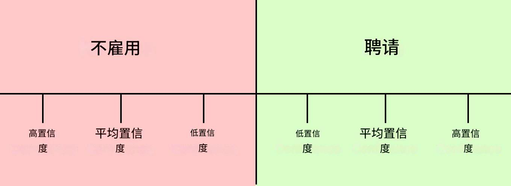

# 行为面试评分标准

_以下页面由_[_Lior Neu-ner_](https://www.linkedin.com/in/liornn/)_提供，他是前 Meta 工程经理和远程技术职位招聘网站_[_Remote Rocketship的创始人。_](http://remoterocketship.com/)

### 如何评估 

与技术面试不同，行为面试在评估标准方面差异更大。然而，大多数顶级科技公司都使用公司价值观来评估候选人。面试官通常必须填写一个部分，评估候选人如何表现出符合公司价值观的行为。出于这个原因，你应该搜索公司的文化和价值观，并确保在你的答案中体现它们。你也会发现与你申请的公司目前工作的一位联系人交谈很有用，以了解更多关于团队通常重视哪些价值观的信息。

评估的一些常见价值观示例包括：

* **动机**- 您的动力是什么？理想的候选人应具有上进心，对具有真正影响力的技术和产品充满热情。
* **积极主动的能力**- 您是否能够采取主动？面对一个难题，您是否能够想出解决办法并付诸实施？
* **在非结构化环境中工作的能力**- 在模棱两可的情况下，您能多好地承担责任？还是您依赖别人来告诉您该做什么？
* **毅力**——您能够克服困难的问题或阻碍吗？
* **冲突解决**——您能多好地处理和解决具有挑战性的关系？
* **同理心**——您能多好地从他人的角度看待事物并理解您的动机？
* **成长**- 你对自己的优势、劣势和成长领域了解多少？你是否在不断努力成长？
* **沟通**——您能在采访中清楚地传达您的故事吗？

为了评估这些重点领域，面试官会询问您的工作经历，并深入了解您处理各种情况的细节。为了评估您的资历，对于每个重点领域，他们会确定情况的范围是否符合他们对初级、高级或高级工程师的期望（有关详细信息，请参见下文）。

### 示例问题和答案 

以下是面试官如何收集候选人每个重点领域的信号的问题和答案。在典型的面试中，他们会问你五六个问题，并深入了解每个情况的细节。每个问题可能会提供多个重点领域的信号。

#### 动机 

示例问题：

* 您最自豪的项目是什么？为什么？
* 告诉我最近某一天工作中非常棒和/或有趣的事情。

回复示例：

* 初级人员：讲述一个让他们感到自豪的、对他们的团队产生影响的项目的故事。
* 高级人员：一个关于他们引以为豪的、对他们的团队产生重大影响的项目的故事。
* 员工：一个关于他们引以为豪的、对他们的组织产生重大影响的项目的故事。

#### 积极主动的能力 

示例问题：

* 请告诉我您想要改变超出您正常工作范围的事情的一次经历。
* 请告诉我你必须快速做出决定并承担结果的一次经历。

回复示例：

* 初级：讲述他们主动建议并推动的变革，这些变革对他们团队的重点领域产生了影响。通常只需要候选人自己努力即可。
* 高级：讲述他们主动建议并推动的变革，对整个团队产生了影响的故事。通常需要三人或更多人参与。
* 员工：讲述他们主动建议并推动的变革，该变革对整个组织产生了影响。通常需要两个或更多团队共同努力。

#### 能够在非结构化环境 

示例问题：

* 您如何决定下一步要做什么？
* 告诉我有关不明确或未明确说明的项目或任务的信息。

回复示例：

* 初级：讲述一个模糊任务的故事，候选人承担了该任务，并能够与团队中的几个利益相关者达成共识。通常只需要候选人自己动手即可。
* 高级：讲述一个模糊项目的故事，候选人负责该项目并能够推动团队或组织中利益相关者的共识。通常需要三人或更多人参与。
* 员工：讲述一个模糊项目的故事，候选人负责该项目并能够推动其组织内利益相关者达成共识。通常需要两个或更多团队合作。

#### 坚持不懈 

示例问题：

* 请告诉我您需要克服外部障碍来完成任务或项目的情况。
* 告诉我某次项目花费的时间比预期的要长的情况

回复示例：

* 少年组：这是一个关于一项存在诸多技术困难的任务以及他们如何克服每个障碍的故事。
* 大四学生：这是一个关于一个项目的故事，该项目存在许多技术难题，阻碍了他们的团队，以及他们如何克服每个难题。
* 工作人员：这是一个关于一个项目的故事，该项目存在许多技术难题，阻碍了许多团队，以及他们如何克服每个障碍。

#### 解决冲突和同理心 

示例问题：

* 请告诉我您认为最难合作的一个人或一个团队。
* 告诉我一次你与同事意见不合的经历。
* 请告诉我两个团队无法就前进的道路达成一致的情形。

回复示例：

* 初级：讲述他们如何与同事就一个大型项目的实施细节解决分歧的故事。
* 高级：讲述他们如何与一些同事或团队负责人就一个更大项目的方向解决分歧的故事。
* 员工：讲述他们如何解决两个或多个团队在一个大型项目方向上的分歧的故事。

#### 成长 

示例问题：

* 描述你犯错的情况以及从中学到的东西。
* 告诉我您从经理或同事那里收到的一些建设性反馈。
* 告诉我你在同事或导师身上观察到的你想要在未来六个月内培养的一套技能。

回复示例：

* 初级学生：讲述他们想要学习的一项新技术以及他们在学习该技术方面所取得的进步的故事。
* 高级：讲述他们想要培养的软技能或技术技能以及他们在学习这些技能方面取得的进展。通常这项技能可能会影响整个团队。
* 员工：讲述他们想要培养的软技能或技术技能以及他们在学习这些技能方面取得的进展。通常，这项技能可能会影响两个或更多团队。

#### 沟通 

* 面试时通常会涉及他们如何清晰地解释故事。与同理心和他们如何与他人沟通也有一些重叠。

### 采访后 

面试结束后，面试官将汇总他们的反馈，并给出聘用/不聘用的建议以及候选人的资历。聘用/不聘用的决定以范围的形式给出，从低信心到高信心。如下所示：

<figure><figcaption>
面试-雇用-频谱
</figcaption></figure>

该建议是根据面试官在八个重点领域收集的信号汇编而成的。通常，它看起来如下：

* 对于初级工程师，如果他们在几乎所有八个重点领域都表现出积极的信号，就会给出聘用建议。
* 对于高级工程师，如果他们在几乎所有八个重点领域都表现出积极信号，并且达到我们对高级工程师的期望水平，则给予聘用建议。否则，不予聘用。
* 对于高级工程师，如果他们在几乎所有八个重点领域都表现出积极信号，并且达到了我们对高级工程师的期望水平，则将给出聘用建议。否则，在员工级别上不会给出聘用建议，尽管他们可能会在高级职位上给出聘用建议。

值得一提的是，面试官的决定并非最终决定。在收集了所有面试反馈后，面试官将与“汇报委员会”讨论候选人的顾虑或优势。
